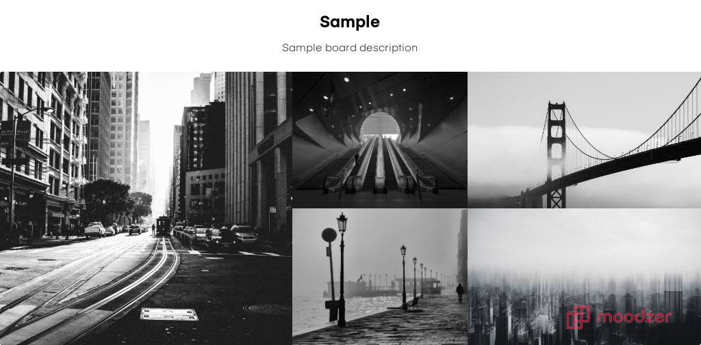

# Portfolio - Dyson Sumsion

### Link to site: https://dyson-sumsion.netlify.com/

### Link to Github: https://github.com/DysonSumsion/Portfolio

#
## Description
### Purpose:
#### The purpose for my portfolio site was to acheieve a sleek yet functional design, in which every user regardless of 'tech savyness' were able to clearly see where information was. One of my big goals was to find great images which complement each other well to keep the theme of the site the same throughout.

### Functionality/Features:
#### I wanted the functionality of my site to be very straight forwards so I went for a continuous scrolling site with a parallax type scrolling effect which only works if your device width is above 568px otherwise the feature will disable.

### Sitemap:
#### As the website is continuously scrolling the site map below is fairly basic

### Screenshots:

### Target Audience
#### The intended target audience is anyone who is indeed of help with regards to a web development project. People such as future employers/clients.

### Tech Stack
#### The site was completely written in HTML5/CSS3. Javascript was avoided throughout as it was a requirement by our teachers, however in the future I would like to use small amounts of Javascript to add animations and things of that nature. Figma was a huge part of my project as all of the planning at design was done there, it made it incredibly easy to put ideas in my head into a real-life visual. CSS3 was used to create the 'parallax' effect on devices with more than 568px. The contact section uses formspree to forward contact details directly to my email account. Git and GitHub were also a huge part of this project as they were used for version control and in conjunction with Netlify was how the site was deployed. Google fonts was also helpful for deciding fonts

#

# Design & Brainstorming

### Design Process
#### The design process was entirely done through moodzer to come up with background photo ideas as well as Figma to come up with the functionality and look of the site.

### Moodzer

### Figma
#### Figma was used to put images to screen as well as text colour and alignment

### Google Fonts
#### I also used google fonts to use throughout my site for consistency https://fonts.googleapis.com/css?family=Raleway&display=swap

### Wireframes
#### I only mocked up a desktop version as I wanted to focus on that design, however then later took great time to comeup with a phone version as I wasnt able to use the 'parallax' effect on mobile devices

### Usability Consideration
#### Ultimately I wanted a site that was sleek yet extremely functional for any user. I used photos I thought would gain the users attention and what to scroll to see whats next. I initially had issues getting the 'parallax' effect disabled on the phone devices however overcame it with media queries.

#
# Project Plan and Timeline
### We were set just under two weeks to get the site completed which I believed was reasonable to complete what I had envisioned. I wanted to acheive a MVP with minimal information and just getting the format of the 'parallax' effect working throughout my site before actually beginning to put any real information in. Once I acheived this I set off on finding the right images which complement each other and I believe I found that. Once this was done I put all relevant information about myself and almost had a complete project, the last thing to do was right media queries for smaller devices and then go on to write the REAMme.

#
# Short Answers
### **Describe key events in the development of the internet from the 1980s to today (max. 150 words)**

#### Originally organisations saw an opportunity to benefit all which would connect all of their computers with big corporations and government agencies to help transfer information and communicate better to one another. In 1981 the NSF (National Science Foundation) gave a grant to begin what was called CSNET (Computer Science Network) to help give networking services to scientists. In 1982 this was followed by Transmission Control Protocol and Internet Protocol becoming the what we know as today TCP/IP, this quickly became the protocol for ARPANET. In 1986 the biggest step towards a US nation expanding their networks throughout the country with NSFNET going online which is connected to supercomputer centres at 56,000 bit per second. From there the the number of internet hosts exceeds 20,000 in 1987 and the now huge company Cisco shipped its first ever router.

### **Define and describes the relationship between fundamental aspects of the internet such as: domains, web servers, DNS, and web browsers (max. 150 words)**

#### Domaiin names are readable names used for sites on the internet. IP addresses is how you access all web servers/sites on the internet. DNS allows you to map IP address from domain name. Once IP is resolves, routes through to the correct web server where the requests are processed and pages are returned (HTML/CSS/Javascript). The browser then presents the page in readable format.

### **Reflect on one aspect of the development of internet technologies and how it has contributed to the world today (max. 150 words)**

#### I think one of the biggest developments in internet technologies would definitely have to be mobile phones. Not only has it created a new marketplace for millions of apps but its also changed the way people communicate with each other. With things like FaceTime/Video Calls it makes it increasingly easier to talk to people on a more personal level through mobile devices. It’s both had positive and negative effects on the people around the word but nonetheless its significance cannot be overlooked. This massive growth in such short amount of time has truely pushed innovation to a whole new level with the power of a mobile device, as well as accessibility to all.
